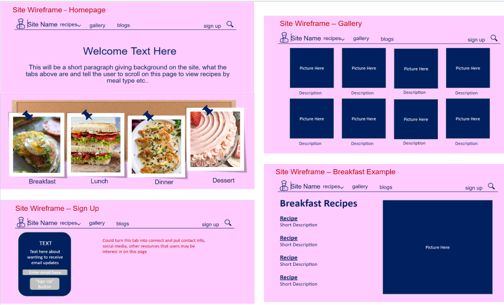

# Website Documentation

### Reflection & Document Overview
Using a static site generator I created a documentation website, using primarily java script to create a homepage and a gallery. These pages use lists and functions to display images and text which link to recipe pages. The formatting for these pages is pulled from css files and the recipes themselves are markdown text files. I chose this for my independent study in order to gain experience in UX Design, as this is one of the disciplines I may have to do a rotation in in my upcoming job. I also wanted to get more experience coding, using Github, working in the command line and trouble shooting technical problems on my own.

The following explains all files/ folders which should remain unchanged & which files/ folders can be changed, as well as what types of changes can be made in each of those files:

Files & Folders that SHOULD NOT be modified:
These are either autogenerated by docusaurus or change through edits to other files and/ or installs.
- **'docusaurus'** folder
- **'build'** folder
- **node_modules** folder
- **.gitignore**: 
- **babel.config.js** file
- **package.json & package-lock.json** files
- **sidebars.js** file

Files & Folders that SHOULD/ can be modified:
- **'blog'** folder: 
  - this folder contains markdown x files which make up the blog content. This page does not currently show up on the live website, but to change that it 
    it can be uncommented from the 'docusaurus.config' file under the nav bar items section.
- **'docs'** folder: 
  - This is where all the recipe markdown files and their images are located. Each recipe section has its' own _category_.json file which label and order 
    the sidebar elements.
- **src** folder: 
  - custom.css file which applies formatting to entire website, such as color scheme and theme
  - the gallery.js and index.js files which create the code for those pages via lists and functions
  - the index.module.css file which applies formatting specifically to the headers and images in the gallery and homepage.
- **static** folder: 
  - stores images for gallery and homepage as well as website icons.
- **docusaurus.config.js** file:
  - used to help deploy site (changing url, git user etc), including navigation bar items (including certain api search keys), footer items, site title changes, themes
- **.env** & **config.json** file: 
  - functionality of search feature, most config items do not need to be changed but the information in the .env file is site specific and should be changed to match your own algolia (hosted search engine platform) account projects for search bar creation.


### Wireframes

The following wireframes were created in ppt in the ideation phase of my project and then adjusted based off logistics/ capabilities.

  


### Research

Before starting the project I also did techkits from the OPIM Innovate lab on github and git bash to learn their basic use & git functions. Github was not only helpful in hosting my site and being able to go back on changes, but to see similar code other people had done and understand it so it could be modified and incorporated into my code when I was having issues adding features etc.

I also did research through the docusaurus site, youtube video & stack overflow searches to troubleshoot problems I encountered. Two of the bigger problems I encountered during this project were:

  **Problem**: Trouble displaying & linking gallery photos to recipe pages.   
    **Solution**: I created a function in the gallery.json file to connect the links properly and then a seperate 'export default' function which took these elements and displayed them to the homescreen rather than trying to fit all the images/ links in a single function. Docusaurus also originally had the index functions written in 2 separate files, having this error allowed me to better understand the functions and re-write/ combine the code for the index so it was in a single file, also included linking, and was easier to read and change features.

  **Problem**: Issue with getting git bash command to scrape site.  
    **Solution**: The documentation for implementing an Algolia search bar was wrong after checking all my installations and that I had the private and public API keys in the write documents (.env and docusaurus.config) I was still getting an error from gitbash. I was able to find the solution to this error message from stack overflow.
    
### Installations

The following software must be installed on your device in order to modify the website locally and/ or deploy changes.

- [Git](https://git-scm.com/downloads)
- [VS Code](https://code.visualstudio.com/download)
- [Yarn](https://classic.yarnpkg.com/lang/en/docs/install/#windows-stable)
- [Node JS](https://nodejs.org/en/download/)

### Site Set Up

#### Docusaurus & Local Folder
1. Open file explorer and create a new folder titled `BC-Recipes` 
2. Click on the file path for this new folder on the top of the file explorer, highlight it and type `cmd` and press `enter`.
3. A new command line should appear, here you can type `npx create-docusaurus@latest BC-Recipes classic --typescript` this will create a pre-populated subfolder from the static site generator [Docusaurus 2](https://docusaurus.io/)

#### Linking to Git Repo
1. Create an empty repository in Github with the same name `BC-Recipes`
2. Same as step 2 from above.
3. In the command line type `git init` and hit `enter`
4. Next type `git add .` to add all the files from this folder into the repo
5. Commit the change with `git commit -m "intial commit"` and press `enter`
6. Use the steps provided by github to push an existing repository from the command line
    ```
      git remote add origin https://github.com/betty-cracker-recipes/BC-Recipes.git
      git branch -M main
      git push -u origin main
     ```
### Crawling the Site
Use the Algolia Docsearch Crawler documentation from the resources section below to create a search bar. This documentation will also take you through all the necessary installations to get the search feature working.

Once the `.env` and `config.json` files are created, modify the `docusaurus.config.js` file to include Algolia. The theme config should be modified to include: 
 ```
   algolia: {
          apiKey:'095d0154d0a88751c86fdf134f5f5775',
          indexName:'bc',
          appId:'33MRM77352',
      },
 ```

 Once all these steps are complete you will need to open the Git Bash Terminal and run the following commands:
 Since the site is crawled based off the URL all documents must be updated and pushed to the gh-pages live branch, otherwise they will not be added to the search feature.

 1. Enter the site folder:
  ```
  cd "C:\Users\Jessica\Desktop\BC-Recipes"
  ```
 2. Crawl the site:
  ```
  docker run --env-file=.env -e "CONFIG=$(cat ./config.json | jq -r tostring)" algolia/docsearch-scraper
  ```


   
### Local Development
```
 yarn start
```
To test changes without pushing them to the git repository or deploying them to the live site this command can be used. 

It will open a window in your browser which runs the site locally and allows you to view change in real time without committing them.

### Github Pages Deployment
```
cd BC-Recipes
```
Navigate to repository folder.

```
cmd /C "set GIT_USER=betty-cracker-recipes&& yarn deploy"
```
Push changes to the deployment branch. 
The first time this command is run should create the gh-pages branch.

### Additional Resources
- [Undraw](https://undraw.co/illustrations): HomePage Images
    - The Docusaurus [Styling & Layout Guide](https://docusaurus.io/docs/styling-layout) can be used to change site color schemes, you can also copy the HEX codes from this page into Undraw for color matching.
- [ICONS8](https://icons8.com/icons/set/favicon): Main Site Icon
- [Favicon](https://favicon.io/): Site Tab Icon
- [Algolia](https://www.algolia.com/): Search Feature
    - For more info on how to use Algolia DocSearch [click here](https://docsearch.algolia.com/docs/crawler/)
- [MailChimp](): Email List Management
- [Docusaurus Styling](): styling tips, hex code generation for light & dark mode infima variables.


