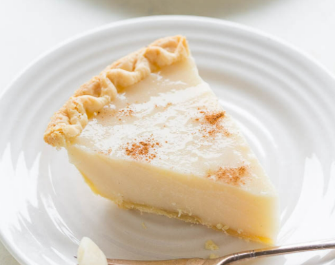

# Sugar Cream Pie
A low-effort, sweet vanilla-custard pie.

### Ingredients
  - ¾ cup Granulated Sugar
  - ¼ cup Corn Starch
  - ½ tsp. Cinnamon, for garnish
  - 1 tsp. Pure Vanilla Extract
  - 5 tbsp. Unsalted Butter, divided
  - 1 cup Half and Half
  - 1 cup Heavy Cream
  - 1 Whole Pie Crust

### Preparation
  - Preheat the oven to 325°F, then pre-cook pie crust for 12-18 minutes.

### Instructions
  1. In a small bowl, mix the sugar and cornstarch; set aside.

  2. On low to medium heat in a medium-sized saucepan, add 4 tablespoons of butter, the heavy cream and half and half. After the butter has melted, with a wire whisk slowly add the cornstarch/ sugar mixture. Cook stirring constantly with a wire whisk just until the mixture is thick and creamy. This will take around 10-15 minutes.

  3. Remove from heat and stir in vanilla extract.

  4. Immediately pour the mixture into the pie crust and drizzle the remaining 1 tablespoon butter, melted. Sprinkle with cinnamon. Place the pie under the broiler until the butter bubbles. This takes around 2 minutes.

  5. Refrigerate.

   