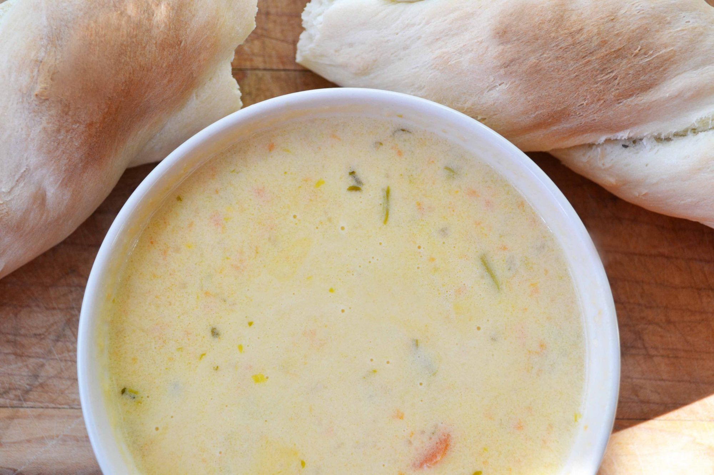

# Cheddar Ale Soup
Cheddar Ale Soup is an amazingly comforting cheesy, flavorful soup made with veggies, beer, and lots of sharp cheddar cheese.

### Ingredients:
 - 4 tbsp. salted butter
 - 1 bay leaf
 - ½ cup minced onion
 - ⅓ cup flour
 - ¼ cup minced celery
 - 12 oz. ale
 - ¼ cup minced carrot
 - 2 ½ cups 1% milk
 - 1 tsp. dry mustard
 - 1 lb. sharp cheddar (about 4 cups grated)
 - salt/ pepper as needed
 - 1 (14 oz. can) 99% fat-free chicken broth

### Instructions:
 1. Melt butter in a large saucepan over medium heat, add onion, carrot, celery and bay leaf (stir for 4 minutes/ til vegetables are translucent + soft).

 2. Stir in flour, cook for about 3 more minutes.

 3. Whisk in ale for about 2 minutes (mix until bubbling + thickened), whisk milk, chicken broth, and dry mustard (Bring to simmer stirring often so it doesn’t scorch bottom of pan).

 4. Lower heat + add cheese handful at a time stir until cheese is melted, but don’t let soup boil.

 5. Remove from heat, take out bay leaf, add salt/ pepper.

 

