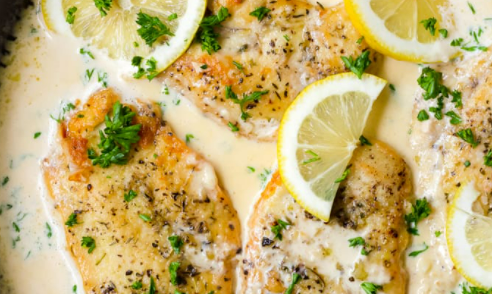

# Creamy Lemon Chicken
 Pan cooked creamy lemon garlic chicken with white wine.

### Ingredients
- ½ cup Half & Half
- Garlic
- Salt 
- Pepper
- 3-5 tbsp. Butter
- 1 cup White Cooking Wine
- 1 Full Lemon
- 6 Chicken Breast Cutlets
- 3 tbsp. Olive oil, optional
- Pasta, optional

### Instructions
1. Tenderize chicken breast cutlets and season with salt pepper and garlic. Cook in pan (two at a time) on medium heat with olive oil or butter for roughly 6 minutes, flipping half way through.

2. Set aside cooked pieces and leave any remaining garlic pieces etc in pan.

3. Melt 3 tbsp. of butter in the pan.

4. Once melted add cooking wine and let bubble, then reduce heat to medium-low and stir in half and half and lemon juice. 

5. Add chicken back into pan on low heat for an additional 6 minutes, flipping half way through and serve over pasta.

