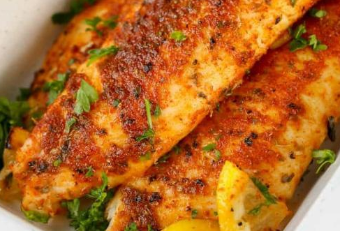

# Spicy Lemon Sole 
Fish marinated in olive oil and lemon juice, then seasoned with old bay.

### Ingredients
- 2 Slices of Sole
- Old Bay Seasoning
- 1 Whole Lemon
- Salt
- Pepper
- 4 Bay Leaves
- 4 tbsp. Olive Oil

°F
### Instructions

