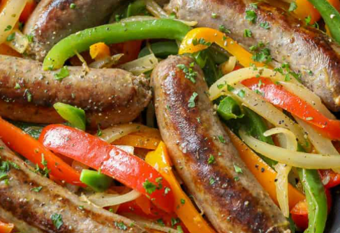

# Sausage & Peppers
Simple, pan cooked hot sausages, peppers, and onions. No seasoning necessary.

### Ingredients
 - 1 Pack Hot Sausages
 - 1 Red Pepper
 - 1 Green Pepper
 - 1 Red Onion
 - 2 tbsp.Vegetable Oil

### Instructions
 1. Cut up peppers and onion.

 2. Put olive oil in pan and add sausages, turn frequently with tongs to brown all sides.

 3. Once sausages are browned, add onion and peppers. Cover and cook for around 15 minutes on medium heat.

 4. Remove sausages, cut lengthwise, return to pan with inside of sausage facing bottom of pan (brown this side). Cook for additional 10-15 minutes.

